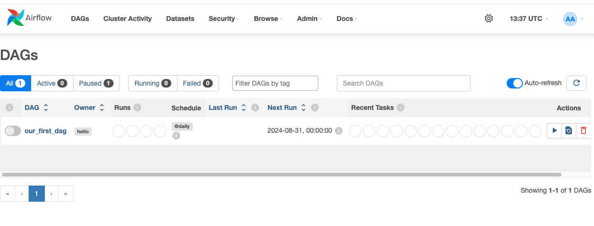
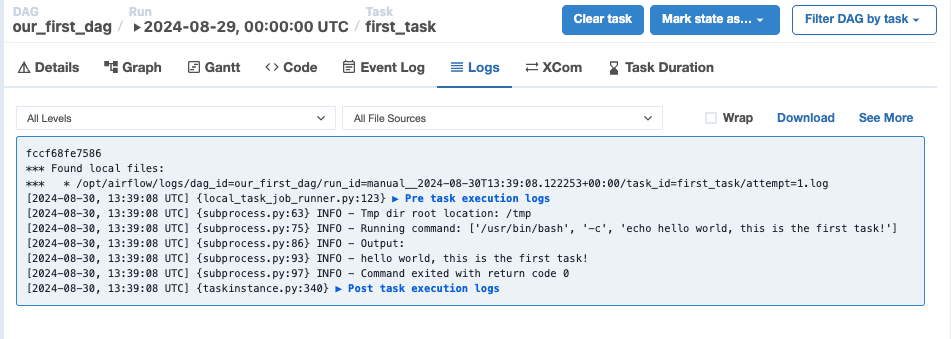

# create dog with bash operator

## 1. 환경설정
1. 우선 한 번 실행해본다.
기본 id, pw : airflow
```
docker-compose up -d
```

2. example dag 지운다. 그러기 위해서 container 끈다.
down -v : volume도 지움
```
docker-compose down -v
```

3. docker-compose.yaml 파일 수정
```
AIRFLOW__CORE__LOAD_EXAMPLES: 'false'
```

4. 그 후 다시 airflow 초기화해준다.
```
docker-compose up airflow-init
```

5. 다시 relaunch
```
docker-compose up -d
```

## 2. DAG 생성

1. dag 폴더에 `our_first_dag.py` 파일을 생성해서 작성
```python

from datetime import datetime, timedelta

from airflow import DAG
from airflow.operators.bash import BashOperator

default_args = {
    'owner' : 'hello',
    'retries': 5,
    'retry_delay': timedelta(minutes=2)
}

with DAG(
    dag_id='our_first_dag',
    default_args=default_args,
    description='This is our first dag that we write',
    start_date=datetime(2024, 8, 30, 2), # 연도, 월, 일, 시간
    schedule_interval='@daily'
) as dag:
    task1 = BashOperator(
        task_id='first_task',
        bash_command='echo hello world, this is the first task!'
        
    )
```

2. 다시 airflow 화면을 refresh하면 다음과 같은 화면 생성


3. 실행해보고 log보면 다음과 같이 찍혀있다.


4. 그리고 second dag를 만들어보자. 파일은 다음과 같이 기존 dag 수정
```python
from datetime import datetime, timedelta

from airflow import DAG
from airflow.operators.bash import BashOperator

default_args = {
    'owner' : 'hello',
    'retries': 5,
    'retry_delay': timedelta(minutes=2)
}

with DAG(
    dag_id='our_first_dag_v2',
    default_args=default_args,
    description='This is our first dag that we write',
    start_date=datetime(2024, 8, 30, 2), # 연도, 월, 일, 시간
    schedule_interval='@daily'
) as dag:
    task1 = BashOperator(
        task_id='first_task',
        bash_command='echo hello world, this is the first task!'
        
    )
    
    task2 = BashOperator(
        task_id='second_task',
        bash_command='echo hey, I am task2 and will be running after task1!'
    )
    
    task3 = BashOperator(
        task_id='third_task',
        bash_command='echo hey, I am task3 and will be running after task1!'
    )
    task1.set_downstream(task2) # downstream설정
    task1.set_downstream(task3) # downstream설정
```

- 새로고침하면 v2 dag가 생성되어있을 것이다. 실행

- task의 Dependeycy를 설정하는 방법은 두 가지가 있다.
```python
task1 >> task2
task1 >> task3
```

```python
task1 >> [task2, task3]
```